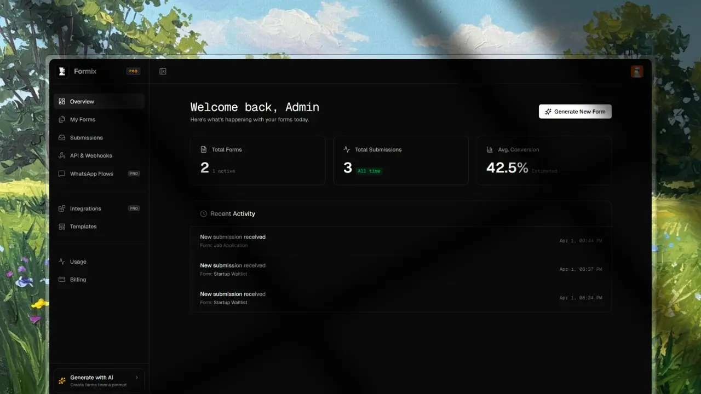

#  Formix

[](https://formix.rikikashyap.dev) [](https://github.com/riki-k-dev/formix) [](https://github.com/riki-k-dev/formix/forks) [](https://github.com/riki-k-dev/formix/issues) [](https://github.com/riki-k-dev/formix/blob/main/LICENSE)

> Stop building form backends. Generate APIs, bots, and micro-forms in seconds.

## What is Formix

Formix is an AI-powered headless form infrastructure. Instead of just generating a rigid drag-and-drop form UI, Formix generates the entire backend system for your forms using natural language. With a single prompt, it creates a structured JSON schema, provisions a ready-to-use API endpoint, and builds a sleek mobile micro-form. Developers can instantly integrate forms into their own applications without writing any backend logic.

[](https://formix.rikikashyap.dev)

## Features

- **Developer-First Headless Architecture**: Bring your own UI. Formix handles the heavy lifting by automatically generating a structured JSON schema, a secure submission API, and a built-in validation layer.
- **AI-Powered Instant Generation**: Powered by Groq AI, simply describe your form requirements, and Formix instantly architects the database, schema, and API.
- **WhatsApp-First Distribution**: Dramatically increase response rates by converting your headless forms into automated conversational bot flows on WhatsApp using the Meta Cloud API.
- **External Integrations & Webhooks**: Route your real-time submission data anywhere instantly. Includes built-in integrations for Slack, Discord, Google Sheets, Airtable, Notion, and Zapier.
- **Hyper-Sleek Micro-Form UI**: When you don't want to build a custom UI, use our hosted, mobile-optimized micro-app style forms with distraction-free swipe navigation.
- **Advanced Rate Limiting**: Built-in Upstash Redis rate limiting to prevent spam and abuse at the IP and User ID levels.
- **Subscription & Billing**: Built-in pricing, billing tiers, and usage gating powered by Dodo Payments.
- **Robust Authentication**: Secure, passwordless and social authentication flows powered by BetterAuth.

## Tech Stack

| Category            | Technologies                                                     |
| ------------------- | ---------------------------------------------------------------- |
| **Frontend**        | Next.js 16 (App Router), React 19, TailwindCSS v4, Framer Motion |
| **Backend**         | Next.js API Routes, Server Actions                               |
| **Database**        | PostgreSQL (Neon DB), Drizzle ORM                                |
| **AI Integration**  | Groq SDK (Llama-3.3-70b-versatile)                               |
| **Auth & Payments** | BetterAuth, Dodo Payments                                        |
| **Infrastructure**  | Docker, Upstash Redis, Resend, UploadThing                       |
| **Tooling**         | TypeScript, ESLint, PNPM                                         |

## Project Structure

```text
formix/
├── app/                  # Next.js App Router (dashboard, api, public forms, blog)
├── components/           # React components (landing, dashboard, ui)
├── content/              # MDX files for the blog
├── db/                   # Drizzle schema, migrations, and database client
├── lib/                  # Core utilities (Auth, Analytics, Payments, Rate Limiting)
├── public/               # Static assets and images
├── Dockerfile            # Multi-stage optimized Docker setup for Next.js standalone
└── docker-compose.yml    # Local deployment and container orchestration

```

## Getting Started

### Prerequisites

- Node.js >= 22 (Required for latest PNPM features)
- PNPM >= 9.x
- Docker (optional, but recommended for production-like environments)

### Option A: Run with Docker (Recommended)

The fastest way to spin up the production-ready build of Formix.

```bash
docker-compose up -d --build

```

This automatically:

- Builds the optimized Next.js standalone application.
- Injects necessary dummy variables for strict SDK constructors during the build phase.
- Starts the production server (`localhost:3000`).

### Option B: Run Manually (Local Development)

If you prefer running the application locally with Hot Module Replacement (HMR):

```bash
pnpm install
pnpm dev

```

## Environment Variables

Duplicate the `.env.example` file to `.env` and fill in your keys.

| Category               | Key Variables                                                                   |
| ---------------------- | ------------------------------------------------------------------------------- |
| **Database**           | `DATABASE_URL`                                                                  |
| **Authentication**     | `BETTER_AUTH_SECRET`, `BETTER_AUTH_URL`, `GITHUB_CLIENT_ID`, `GOOGLE_CLIENT_ID` |
| **AI & External APIs** | `GROQ_API_KEY`, `RESEND_API_KEY`, `UPLOADTHING_TOKEN`                           |
| **Payments**           | `DODO_API_KEY`, `DODO_PRO_PRICE_ID`, `DODO_WEBHOOK_SECRET`                      |
| **Infrastructure**     | `UPSTASH_REDIS_REST_URL`, `UPSTASH_REDIS_REST_TOKEN`, `ENCRYPTION_KEY`          |

## Drizzle Database Management

Manage your PostgreSQL database from the root directory using PNPM.

```bash
# Generate database migrations
pnpm dlx drizzle-kit generate

# Apply pending migrations to the database
pnpm dlx drizzle-kit push

```

## Scripts

Core commands available from the root `package.json`.

| Command      | Description                                                  |
| ------------ | ------------------------------------------------------------ |
| `pnpm dev`   | Starts the application in development mode with Fast Refresh |
| `pnpm build` | Compiles the application for production deployment           |
| `pnpm start` | Runs the compiled production application                     |
| `pnpm lint`  | Runs ESLint across the codebase                              |

## Deployment

Formix is designed to be highly deployable across modern infrastructure.

- **Serverless (Recommended)**: Optimized for native, zero-config deployment on **Vercel**.
- **Containerized (VPS)**: Fully Dockerized with a multi-stage `Dockerfile` allowing deployment on any VPS (AWS EC2, DigitalOcean, Hetzner, Render).
- **Database**: Works best with managed Serverless PostgreSQL providers like Neon.

## Contributing

We welcome contributions from the community. Please follow these steps:

1. Fork the repository.
2. Create a feature branch (`git checkout -b feature/amazing-feature`).
3. Ensure your code passes all linting and formatting checks.
4. Commit your changes with descriptive messages.
5. Open a Pull Request.

## Code of Conduct

We are committed to providing a friendly, safe, and welcoming environment for all. Please behave professionally and respectfully in all interactions within our issue trackers, pull requests, and community channels.

## License

This project is licensed under the MIT License. See the `LICENSE` file for details.
